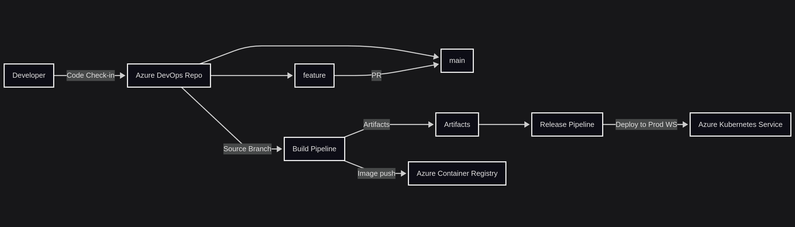
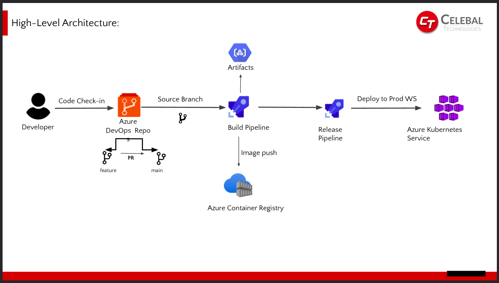

# Azure Kubernetes Service Deployment using Azure DevOps

A comprehensive DevOps project demonstrating CI/CD pipeline implementation for deploying a Next.js application to Azure Kubernetes Service (AKS) using Azure DevOps.

## 🏗️ Project Architecture




## 📋 Project Overview

This project showcases a complete DevOps workflow that includes:

- **Frontend Application**: Next.js application with TypeScript and Tailwind CSS
- **Containerization**: Docker containerization for consistent deployments
- **CI/CD Pipeline**: Azure DevOps pipeline for automated build and deployment
- **Container Registry**: Azure Container Registry for image storage
- **Orchestration**: Azure Kubernetes Service for container orchestration

## 🛠️ Technology Stack

### Frontend
- **Next.js 15.2.4** - React framework
- **TypeScript** - Type-safe JavaScript
- **Tailwind CSS** - Utility-first CSS framework
- **Radix UI** - Accessible component library
- **Lucide React** - Icon library

### DevOps & Infrastructure
- **Azure DevOps** - CI/CD pipeline management
- **Azure Container Registry** - Container image registry
- **Azure Kubernetes Service** - Container orchestration
- **Docker** - Containerization platform

## 🚀 Getting Started

### Prerequisites

- Node.js 18 or higher
- Docker
- Azure DevOps account
- Azure subscription
- kubectl (for local Kubernetes management)

### Local Development

1. **Clone the repository**
   ```bash
   git clone <repository-url>
   cd Final-Project
   ```

2. **Navigate to the App directory**
   ```bash
   cd App
   ```

3. **Install dependencies**
   ```bash
   npm install
   # or
   pnpm install
   ```

4. **Run the development server**
   ```bash
   npm run dev
   ```

5. **Open your browser**
   Navigate to [http://localhost:80](http://localhost:80)

### Docker Deployment

1. **Build the Docker image**
   ```bash
   cd App
   docker build -t my-v0-project .
   ```

2. **Run the container**
   ```bash
   docker run -p my-v0-project
   ```

## 🔄 CI/CD Pipeline

The project implements a complete CI/CD pipeline as illustrated in the diagram above:

### Pipeline Stages

1. **Source Control**: Developer commits code to Azure DevOps repository
2. **Feature Branch**: Development work happens in feature branches
3. **Pull Request**: Code review and merge to main branch
4. **Build Pipeline**: 
   - Code compilation and testing
   - Docker image creation
   - Push to Azure Container Registry
   - Generate deployment artifacts
5. **Release Pipeline**: Deploy to Azure Kubernetes Service

### Pipeline Configuration

The pipeline is configured to:
- Build the Next.js application
- Create Docker images
- Push images to Azure Container Registry
- Deploy to AKS cluster
- Run on port 80

## 🐳 Docker Configuration

The [Dockerfile](App/Dockerfile) uses multi-stage builds for optimization:

- **Base stage**: Install dependencies and build the application
- **Production stage**: Create lightweight production image

Key features:
- Uses Node.js 18 Alpine for smaller image size
- Optimized for production deployment
- Exposes port 80
- Includes only necessary files for runtime

## 🚀 Deployment

### Azure Kubernetes Service Deployment

1. **Set up Azure resources**
   - Create AKS cluster
   - Set up Azure Container Registry
   - Configure service connections in Azure DevOps

2. **Configure pipeline variables**
   - Container registry URL
   - Kubernetes namespace
   - Service principal credentials

3. **Deploy using Azure DevOps**
   - Pipeline automatically triggers on code commits
   - Builds and pushes container images
   - Deploys to AKS cluster

## 🤝 Contributing

1. Fork the repository
2. Create a feature branch
3. Make your changes
4. Submit a pull request
5. Ensure all pipeline checks pass

## 📝 Documentation

Additional documentation can be found in the [Docs](Docs/) directory:
- Pipeline architecture diagrams
- Detailed project presentation
- Infrastructure setup guides

## 🔧 Scripts

Available npm scripts in [package.json](App/package.json):

```json
{
  "dev": "next dev -p 80",      // Development server
  "build": "next build",           // Production build
  "start": "next start -p 80",   // Production server
  "lint": "next lint"              // Code linting
}
```

## 📄 License

This project is part of a DevOps learning initiative and is intended for educational purposes.

---

**Note**: This project demonstrates enterprise-grade DevOps practices including automated testing, security scanning, and production deployment strategies using Azure cloud services.